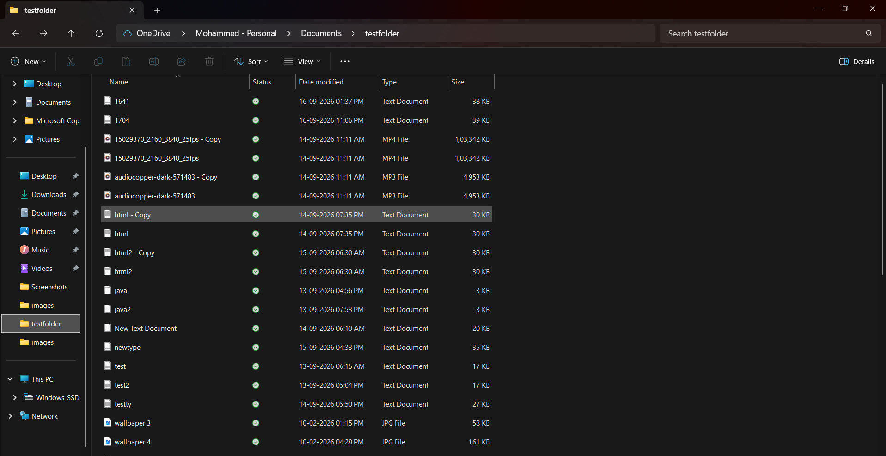
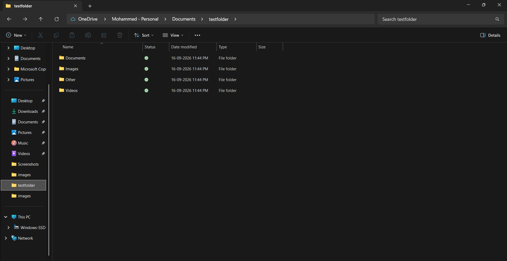
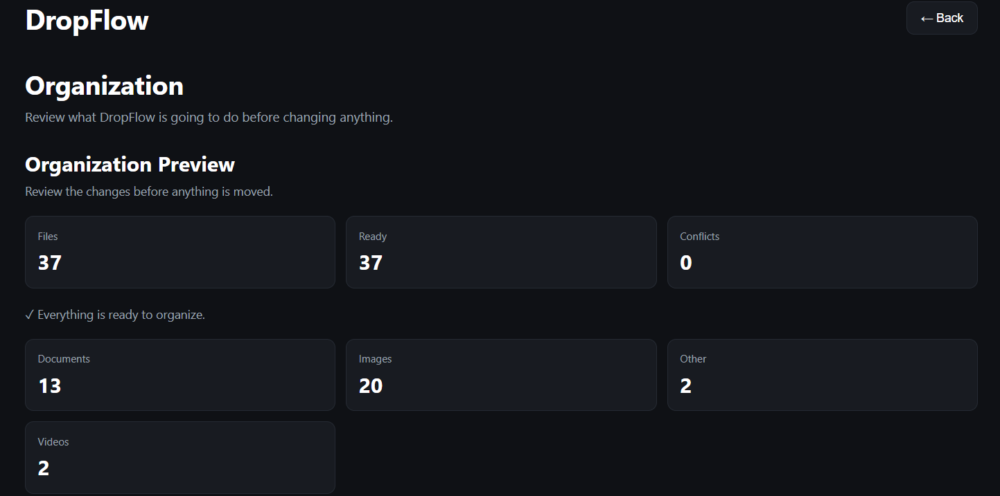
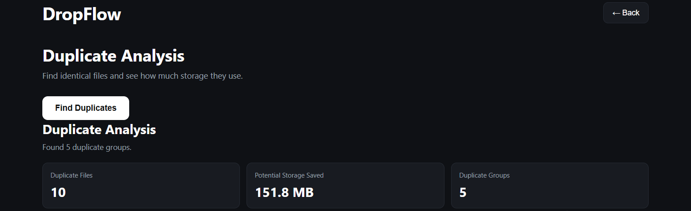
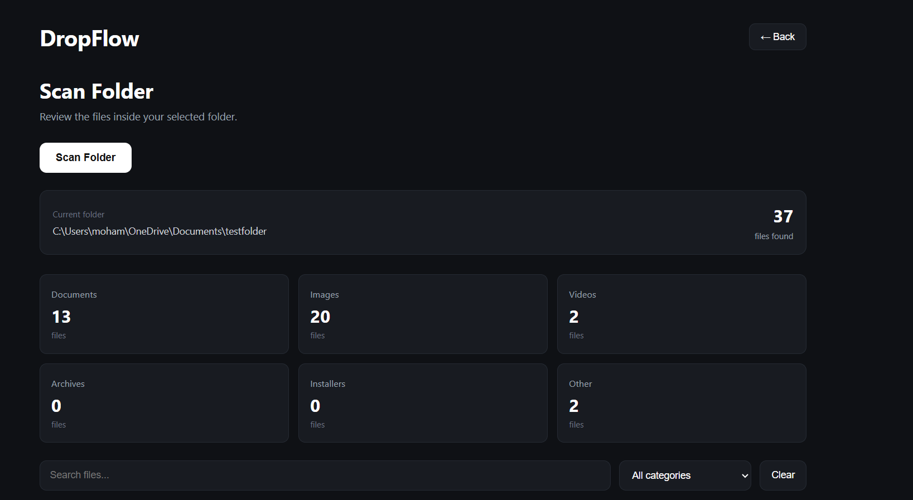

# DropFlow

> **Your downloads folder is a mess. DropFlow isn't.**

DropFlow is a small Windows desktop app I made to clean up messy folders without having to manually move 100 files around.

It scans a folder, figures out what each file is, shows you what it's going to do, and then organizes everything into proper folders.

I built it with **Electron + JavaScript + HTML + CSS**.

## Download

### Windows

**[Download DropFlow v1.0.0](https://github.com/shaazumer066-bot/DropFlow/releases/tag/v1.0.0)**

Download the `.exe`, open it, and you're good to go.

> For your first test, use a folder with copies of files instead of anything important.

## What can it do?

* Scan folders
* Automatically sort files into categories
* Preview changes before moving anything
* Detect file conflicts
* Organize messy folders
* Search and filter files
* Find duplicate files
* Tell originals and duplicates apart
* Navigate between screens
* Show useful file/category stats

## The main flow


Basically:

**Choose folder → Scan → Preview → Organize**

That's the whole idea.

## Before vs After

### Before

A folder full of random files:



### After

DropFlow sorts everything into categories:



```text
My Folder/
├── Documents/
├── Images/
├── Videos/
├── Archives/
├── Installers/
└── Other/
```

## Organization Preview

DropFlow doesn't just start moving files immediately.

First it shows you what it's planning to do:



You can see:

* Total files
* Files ready to move
* Conflicts
* File categories
* Individual file status

So you can check everything before pressing **Organize**.

## Duplicate Finder

DropFlow can also find duplicate files.



It checks the actual file data instead of assuming that files with similar names are duplicates.

So something like:

```text
photo.png
photo - Copy.png
```

isn't automatically treated as a duplicate just because the names look similar.

## Scanning

The Scan screen gives you an overview of the folder:



You can search for a file or filter the results by category.

If you want to remove the filters, just hit **Clear**.

## How to use it

It's pretty straightforward:

**1. Open DropFlow**

**2. Choose a folder**

**3. Press Scan Files**

**4. Look through the results**

**5. Open Organization**

**6. Press Preview Organization**

**7. Check the files and conflicts**

**8. Press Organize Files**

**9. Done.**

You can also open **Duplicate Analysis** if you want to check for duplicate files.

## Why I made this

I wanted to make something that solves a small but annoying problem.

Manually cleaning folders gets boring really fast, especially when there are tons of files.

So instead of making another complicated productivity app, I made DropFlow specifically for this one job.

## Stuff I had to fix

This project definitely didn't work perfectly on the first try

Some of the problems I ran into:

* The UI became one giant scrolling page.
* Organization results were too far down the screen.
* Scanning an already-organized folder wasn't working correctly.
* Duplicate detection sometimes gave confusing results.
* Search/filtering became annoying with lots of files.
* Adding new screens sometimes broke existing navigation.

I fixed these by changing the navigation, improving the scanning flow, adding organization previews and conflict checking, improving duplicate analysis, and adding search/filter controls.

## Tech

```text
Electron
JavaScript
HTML
CSS
Node.js
electron-builder
```

## Run it yourself

Clone the repo:

```bash
git clone https://github.com/shaazumer066-bot/DropFlow.git
cd DropFlow
```

Install everything:

```bash
npm install
```

Start the app:

```bash
npm start
```

Want to build the Windows version?

```bash
npm run build
```

The build will appear inside the `dist` folder.

## Project

**GitHub:**
https://github.com/shaazumer066-bot/DropFlow

**Download:**
https://github.com/shaazumer066-bot/DropFlow/releases/tag/v1.0.0

---

Made for **Stardance**
